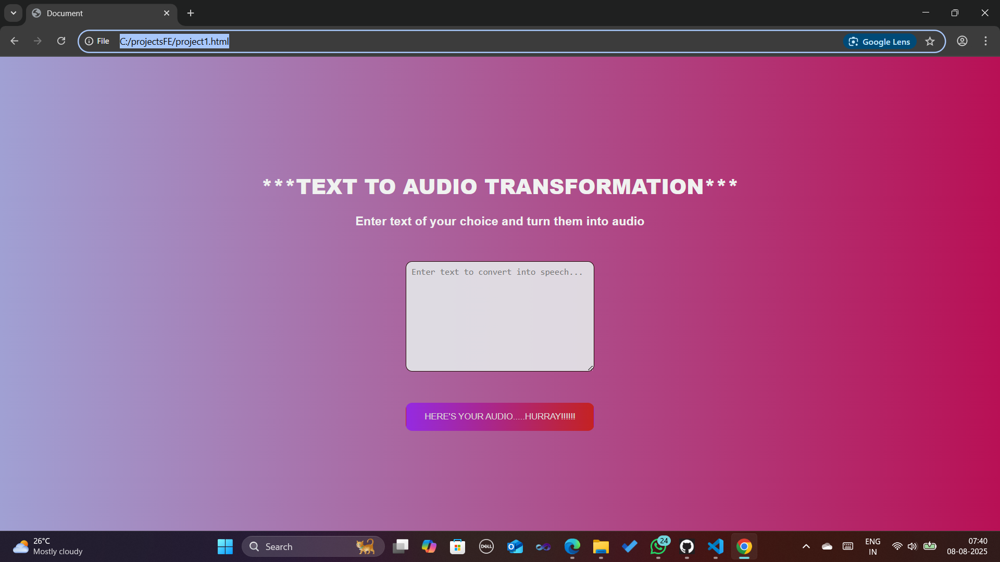

#  Text to Audio Transformation
A simple web app that converts user-entered text into speech using the *Web Speech API*.  
Built with HTML, CSS, and JavaScript.

## Features
- Convert any entered text into audio instantly.
- User-friendly interface with modern styling.
- Real-time error handling for empty input.
- Play audio multiple times with a single click.

##  Tech Stack
- *HTML5*
- *CSS3* (Flexbox, gradients, custom styling)
- *JavaScript (Vanilla)* using SpeechSynthesisUtterance

##  Project Structure
project1.html-->#for structure 
project1.css--->#for styling
project1.js--->#for user interaction 

 ##it's perfect for:  
 Showcasing *JavaScript DOM manipulation* skills.  
 Demonstrating *Web Speech API* integration.  
 Learning *HTML/CSS layout design* with Flexbox.  
 Building small but functional tools for accessibility and learning.

##Key highlights:  
*Error handling* that prevents empty conversions.  
  A dynamic button that changes text after playback.  
  Fully functional in all modern browsers with no installation needed.

##Demo:

##"ATLAST..."
Type it,click it,hear it.A fun browser app that turns your words into audio magically.....

